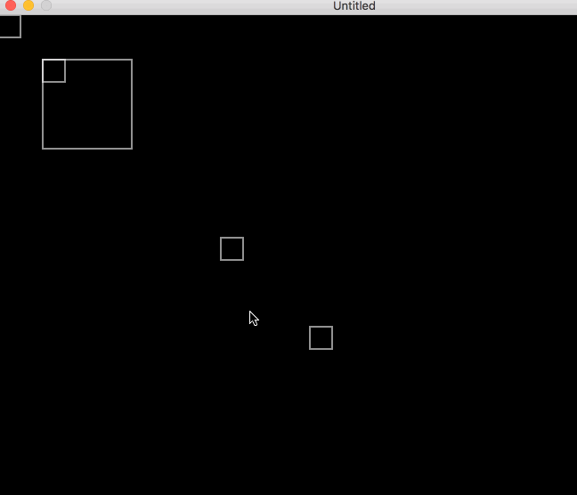

Simple game like Sokoban except that it's inverted — there is no player to push
pieces around. Instead the pieces are outside the target area and you move the
background/world to shift the pieces until they collect in the target area.

Built with Lua and the [Löve2D Engine](https://love2d.org).

A few things to do next:

- The next-position reconciliation needs to account for the next positions
  of the other pieces, not the current positions of those pieces.
  For instance, it should figure out if the space that this piece will go to
  will _be available_, taking into account the movements of other pieces.
- Accommodate pieces that have different sizes (rectangles and ideally
  tetris-like pieces)
  - In order to do this, would need some serious re-working of the collision
    and movement code.
- Figure out when the game is won!
